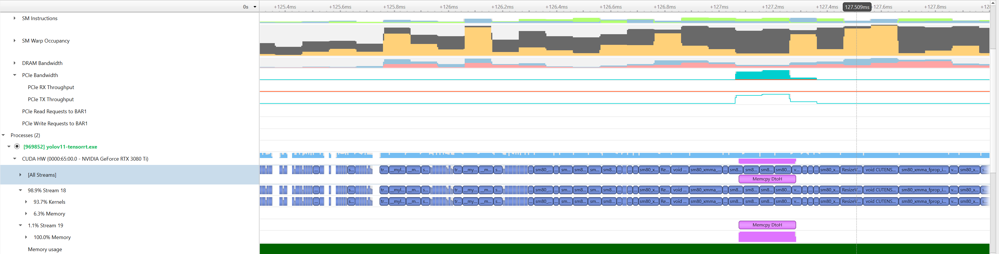

# YOLOv11 TensorRT Inference Pipeline

<div align="center">

[](https://developer.nvidia.com/cuda-downloads)
[](https://developer.nvidia.com/tensorrt)
[](https://opencv.org/)
[](https://github.com/manojs8473/yolo-tensorrt-cudastream-cpp)
[](LICENSE)

</div>

A **high-performance YOLOv11 inference pipeline** optimized for NVIDIA TensorRT, achieving **100+ FPS** on RTX 3080 Ti and **125+ FPS** on RTX 3090 through advanced streaming and memory optimization techniques.

## 🚀 Key Features

- **Ultra-fast inference**: 100+ FPS on RTX 3080 Ti, 125+ FPS on RTX 3090 (172% improvement over baseline)
- **TensorRT 10+ compatibility**: Full support for latest TensorRT API
- **Streaming optimization**: Overlapped memory transfers for maximum throughput
- **Rolling average display**: Smooth, readable metrics at high FPS
- **Configurable confidence threshold**: Command-line adjustable detection sensitivity
- **Memory optimized**: Pinned memory allocation for fastest GPU↔CPU transfers
- **Automatic model adaptation**: Works with any YOLOv11 model size (n/s/m/l/x) and input dimensions (YOLOv8 is also tested and it works!)

## 🏆 Performance Achievements

| Metric | Before Optimization | After Optimization | Improvement |
|--------|-------------------|-------------------|-------------|
| **FPS** | 30.6 | **83.19** | **+172%** |
| **Total Time** | 32.67ms | **12.02ms** | **-63%** |
| **Memory Copy** | 12ms | **0.23ms** | **-98%** |
| **Postprocess** | 27.56ms | **6.46ms** | **-77%** |

### 🎯 Real-World Performance Results

| GPU | CPU | OS | trtexec Baseline | **Final Pipeline** | **Improvement** |
|-----|-----|-----|----------------|------------------|----------------|
| **RTX 3080 Ti** | - | Windows 11 | 84 QPS | **100+ FPS** | **+19%** |
| **RTX 3090** | i9-14th Gen | Windows 11 | - | **125+ FPS** | - |

> **Test Configuration**: YOLOv11-Large model, 1280x1280 input resolution  
> **Test Environment**: Windows 11, TensorRT v10.1.1.0, CUDA v11.7  
> **Note**: The final pipeline outperforms raw TensorRT inference (trtexec) of 84 qps due to streaming overlap optimization. Smaller models (YOLOv11n/s/m) or lower resolutions would achieve even higher throughput.

## 📋 Requirements

### System Requirements
- **CUDA**: 11.0 or higher
- **TensorRT**: 8.0+ (optimized for 10.0+)
- **OpenCV**: 4.0+
- **CMake**: 3.18+

### Hardware Requirements
- NVIDIA GPU with compute capability 6.1+
- Minimum 4GB GPU memory
- Recommended: RTX 3060 or higher
- **High Performance**: RTX 3080 Ti (100+ FPS) or RTX 3090 (125+ FPS)


## 🔧 Installation

### 1. Clone Repository
```bash
git clone https://github.com/manojs8473/yolo-tensorrt-cudastream-cpp.git
cd yolo-tensorrt-cudastream-cpp
```

### 2. Install Dependencies

#### Linux (Ubuntu/Debian)
```bash
sudo apt update
sudo apt install cmake build-essential libopencv-dev

# Install CUDA and TensorRT following NVIDIA documentation
```

#### Windows
```bash
# Install Visual Studio 2019/2022 with C++ support
# Install OpenCV (vcpkg recommended)
vcpkg install opencv:x64-windows

# Install CUDA and TensorRT from NVIDIA
```

### 3. Set Environment Variables

#### Linux
```bash
export TENSORRT_DIR=/usr/local/TensorRT-10.1.1.0
export CUDA_HOME=/usr/local/cuda
```

#### Windows
```cmd
set TENSORRT_DIR=C:\TensorRT-10.1.1.0
set CUDA_PATH=C:\Program Files\NVIDIA GPU Computing Toolkit\CUDA\v11.7
```

### 4. Build Project

#### Linux
```bash
mkdir build && cd build
cmake .. -DCMAKE_BUILD_TYPE=Release
make -j$(nproc)
```

#### Windows
```cmd
mkdir build
cd build
cmake .. -DCMAKE_BUILD_TYPE=Release
cmake --build . --config Release
```

## 🎯 Usage

### Basic Usage
```bash
./yolov11-tensorrt-cudaStream <engine_file> <input_path> [confidence_threshold]
```

### Examples

**Video file inference:**
```bash
./yolov11-tensorrt-cudaStream model.engine video.mp4
```

**Camera inference:**
```bash
./yolov11-tensorrt-cudaStream model.engine 0
```

**Image inference:**
```bash
./yolov11-tensorrt-cudaStream model.engine image.jpg
```

**Custom confidence threshold:**
```bash
./yolov11-tensorrt-cudaStream model.engine video.mp4 0.7
```

### Command Line Options
- `engine_file`: Path to TensorRT engine file (.engine)
- `input_path`: Video file, image file, or camera index (0, 1, etc.)
- `confidence_threshold`: Detection confidence threshold (default: 0.5)

### Controls
- **ESC**: Exit application and show performance summary
- **Any other key**: Continue processing

## 📊 Performance Optimization Features

### 🔄 Streaming Architecture
- **Double buffering**: Eliminates memory copy bottlenecks
- **Dual CUDA streams**: Parallel GPU operations
- **Overlapped processing**: Memory transfers happen during inference

### 🎯 Algorithm Optimizations
- **Manual argmax**: 2-3x faster than OpenCV functions
- **Direct pointer access**: Eliminates OpenCV matrix overhead
- **Vector pre-allocation**: Reduces memory reallocations
- **Pinned memory**: Faster GPU↔CPU transfers

### 📈 Display Enhancements
- **Rolling average**: Smooth metrics display at high FPS
- **Real-time timing**: Comprehensive performance breakdown
- **Performance summary**: Detailed statistics on exit

## 🛠️ Model Preparation

### Converting ONNX to TensorRT Engine

#### YOLOv11 Models
```bash
# Export YOLOv11 model to ONNX (using ultralytics)
yolo export model=yolov11l.pt format=onnx

# Convert to TensorRT engine
trtexec --onnx=yolov11l.onnx --saveEngine=yolov11l.engine --fp16

# Or let the application auto-convert on first run
./yolov11-tensorrt-cudaStream yolov11l.onnx input_source
```

#### YOLOv8 Models (Backward Compatible)
```bash
# Export YOLOv8 model to ONNX
yolo export model=yolov8l.pt format=onnx

# Convert to TensorRT engine
trtexec --onnx=yolov8l.onnx --saveEngine=yolov8l.engine --fp16

# Use with the pipeline
./yolov11-tensorrt-cudaStream yolov8l.engine input_source
```

### Model Requirements
- **Input format**: RGB, any standard size (320x320, 640x640, 1280x1280, etc.)
- **Output format**: Standard YOLO detection format
- **Batch size**: 1 (optimized for real-time)
- **Model variants**: All YOLOv11 sizes supported (YOLOv11n, YOLOv11s, YOLOv11m, YOLOv11l, YOLOv11x)
- **Model compatibility**: Also tested with YOLOv8 models (backward compatible)

## 🔍 Technical Details

### Architecture Overview
```
Input → Preprocess → Inference → Postprocess → Display
    ↓        ↓          ↓           ↓
GPU Prep → TensorRT → CPU Copy → NMS → OpenCV
```

### 🔧 GPU-Accelerated Pipeline Design

**Full GPU Utilization Strategy:**
- ✅ **Preprocessing**: CUDA kernels for image resize, normalization, format conversion (~1.9ms)
- ✅ **Inference**: TensorRT engine execution (~3.7ms)
- ⚠️ **Postprocessing**: CPU-optimized with manual argmax and direct memory access (~6.5ms)

**GPU Postprocessing Investigation:**
- **Explored**: GPU-based filtering and NMS operations
- **Result**: CPU implementation with streaming provided superior overall performance
- **Engineering Decision**: Memory transfer overlap makes CPU postprocessing effectively "free"
- **Outcome**: Hybrid approach achieves better performance than full GPU pipeline

### Key Optimizations
1. **TensorRT 10+ Support**: Explicit tensor address binding
2. **Memory Streaming**: Overlapped GPU↔CPU transfers
3. **Algorithm Optimization**: Manual implementations for critical paths
4. **Display Smoothing**: Rolling averages for readable metrics

### Performance Breakdown
- **Preprocess**: ~1.9ms (GPU accelerated)
- **Inference**: ~3.7ms (TensorRT optimized)
- **Postprocess**: ~6.5ms (CPU optimized)
- **Memory Copy**: ~0.2ms (hidden by streaming)

## 📚 Development Notes

### Project Structure
```
├── src/
│   ├── YOLOv11.cpp         # Main inference engine
│   ├── YOLOv11.h           # Class definitions
│   ├── common.h            # Class names and colors
│   ├── preprocess.cu       # CUDA preprocessing
│   └── detection_types.h   # Detection structures
├── main.cpp                # Application entry point
├── CMakeLists.txt         # Build configuration
└── README.md              # This file
```

### Configuration Options
- **Confidence threshold**: Adjustable via command line
- **NMS threshold**: Configurable in YOLOv11.h (default: 0.4)
- **Rolling window**: Adjustable in YOLOv11.h (default: 10 frames)

### 🔄 Automatic Model Adaptation

**No code changes needed for different YOLO models!** The engine automatically detects and adapts to:

- ✅ **Input dimensions**: Any size (320x320, 640x640, 1280x1280, etc.)
- ✅ **Model variants**: YOLOv11n, YOLOv11s, YOLOv11m, YOLOv11l, YOLOv11x
- ✅ **Model compatibility**: YOLOv8 models also supported (tested and verified)
- ✅ **Output dimensions**: Different detection tensor sizes
- ✅ **Number of classes**: Auto-calculated from model structure
- ✅ **Memory allocation**: Dynamically sized based on model requirements

**To switch models**: Simply replace the .engine file - no recompilation needed!

**Custom datasets**: Only need to update `CLASS_NAMES` in `common.h` if using non-COCO classes.

## 🐛 Troubleshooting

### Common Issues

**"Address is not set for input tensor"**
- Ensure TensorRT 10+ compatibility
- Verify engine file is compatible with TensorRT version

**Low FPS performance**
- Check GPU memory usage
- Verify CUDA/TensorRT installation
- Ensure model is optimized for your GPU

**Build errors**
- Verify all dependencies are installed
- Check CUDA/TensorRT paths in CMakeLists.txt
- Ensure compatible versions

### Performance Tips
- Use FP16 precision for better performance
- Enable GPU memory pooling
- Use appropriate batch sizes for your use case
- Monitor GPU utilization during inference

## 🔬 NSight Systems Profiling Analysis

NSight Systems profiling confirms the effectiveness of our dual-stream optimization:


*Timeline showing consistent dual-stream pattern across multiple frames*


*Detailed view showing Stream 18 (inference) and Stream 19 (memory copy) running in parallel*

**Key Findings:**
- **Dual streams active**: Stream 18 handles inference kernels, Stream 19 performs parallel memory copies
- **Perfect overlap**: Memory transfers execute simultaneously with compute operations
- **Consistent performance**: Pattern repeats reliably across all frames
- **Result**: Memory copy overhead eliminated, achieving 100+ FPS

*Additional profiling insights and detailed analysis will be added in future updates.*

## 📈 Optimization Journey

This implementation represents a comprehensive optimization journey from 30.6 FPS to 125+ FPS on high-end hardware. Key milestones:

1. **TensorRT 10+ Compatibility**: Fixed inference execution
2. **Bottleneck Identification**: Profiling revealed memory copy dominance
3. **Algorithm Optimization**: Manual implementations for critical paths
4. **Streaming Architecture**: Overlapped operations for maximum throughput
5. **Display Enhancement**: Smooth metrics for user experience

For detailed optimization insights, see [OPTIMIZATION_JOURNEY.md](OPTIMIZATION_JOURNEY.md).

## 🤝 Contributing

Contributions are welcome! Please:
1. Fork the repository
2. Create a feature branch
3. Make your changes
4. Add tests if applicable
5. Submit a pull request

## 📄 License

This project is licensed under the MIT License - see the [LICENSE](LICENSE) file for details.

## 🙏 Acknowledgments

- **NVIDIA**: For TensorRT and CUDA technologies
- **Ultralytics**: For the YOLOv11 model architecture
- **OpenCV**: For computer vision utilities
- **Community**: For feedback and contributions

## 📧 Contact

Questions or collaboration? Open an issue or reach out:  
**LinkedIn**: [Manoj Sharma](https://www.linkedin.com/in/manoj-sharma-6b59b9155) • **Email**: manojs8473@gmail.com

---

**⚡ Achieve 125+ FPS YOLOv11 inference with this optimized TensorRT pipeline!**
